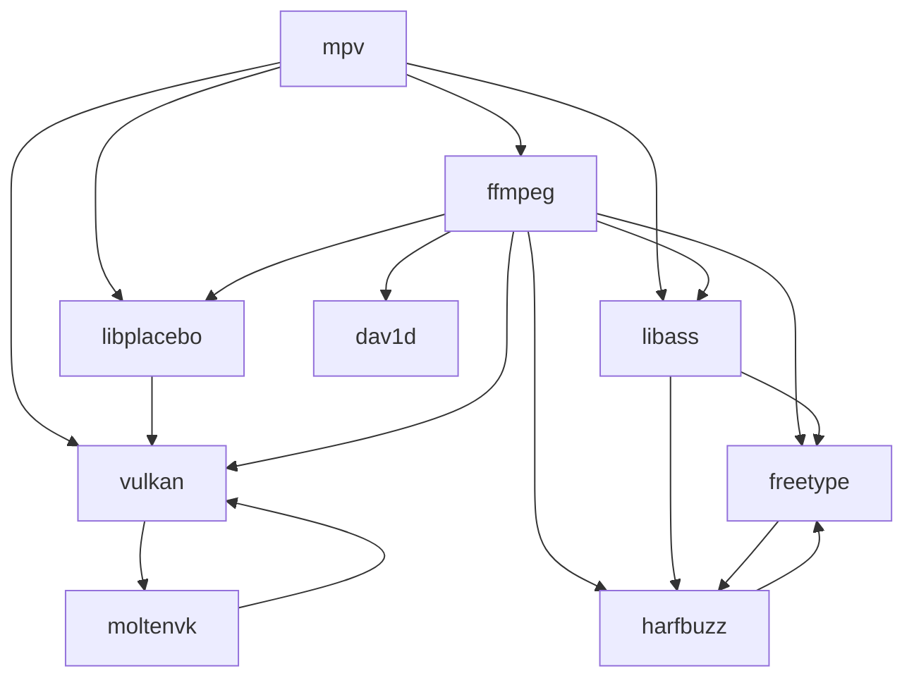

# mpv-build-macOS

A set of scripts that help build [mpv](https://mpv.io) with [MoltenVK](https://github.com/KhronosGroup/MoltenVK) support.

### Requirements

-  [Xcode.app](https://developer.apple.com/xcode/)
-  [Homebrew](https://brew.sh)

### Usage

1. Make sure Xcode is ready by running:

   ```sh
   xcodebuild -runFirstLaunch
   ```

2. Clone the repository:

   ```sh
   git clone "https://github.com/m154k1/mpv-build-macOS.git"
   cd mpv-build-macOS
   ```

3. run `build`. you can specify path which you want to install ffmpeg and mpv to with params `--prefix /path/you/want` and a flag to build `mpv.app`

   ```sh
      ./build

   ```

   or

   ```sh
      ./build --prefix ~/.local
   ```

   or

   ```sh
      ./build --prefix ~/.local --with-bundle
   ```

4. Add binaries to your `$PATH`:

### Configuration

```cfg
# ~/.config/mpv/mpv.conf

vo=gpu-next
gpu-context=macvk
```

### Environment variables

-  `MTL_HUD_ENABLED=1`
   Enables the [Metal Performance HUD](https://developer.apple.com/documentation/xcode/monitoring-your-metal-apps-graphics-performance).

-  `MVK_CONFIG_LOG_LEVEL=3`
   Enables verbose MoltenVK logging.

### Dependency graph


