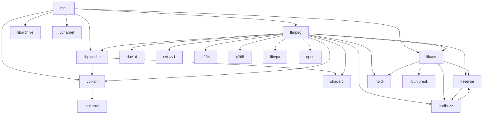

# mpv-build-macOS
A set of scripts that help build [mpv](https://mpv.io) with [MoltenVK](https://github.com/KhronosGroup/MoltenVK) support.  

### Requirements
- [Xcode.app](https://developer.apple.com/xcode/)
- [Homebrew](https://brew.sh)

### Preparation
1. Make sure Xcode is ready by running:  

   ```sh
   xcodebuild -runFirstLaunch
   ```

2. Clone the repository:  

   ```sh
   git clone "https://github.com/m154k1/mpv-build-macOS.git"
   cd mpv-build-macOS
   ```

3. Install dependencies from Homebrew:  

   ```sh
   xargs brew install --formula < homebrew/build.txt
   xargs brew install --formula < homebrew/runtime.txt
   ```

4. Create an installation directory for local packages:  

   ```sh
   sudo mkdir /opt/local
   sudo chown $USER:admin /opt/local
   mkdir /opt/local/stow
   ```

   If you want to use a different directory, export `$PREFIX` environment variable.

### Build and install
1. [**Vulkan Loader**](https://github.com/KhronosGroup/Vulkan-Loader) & [**Vulkan Headers**](https://github.com/KhronosGroup/Vulkan-Headers)  

   ```sh
   git -C src clone "https://github.com/KhronosGroup/Vulkan-Loader.git"
   git -C src clone "https://github.com/KhronosGroup/Vulkan-Headers.git"
   ./build-vulkan
   ```

2. [**MoltenVK**](https://github.com/KhronosGroup/MoltenVK)  

   ```sh
   git -C src clone "https://github.com/KhronosGroup/MoltenVK.git"
   ./build-moltenvk
   ```

3. [**shaderc**](https://github.com/google/shaderc)  

   ```sh
   git -C src clone "https://github.com/google/shaderc.git"
   ./build-shaderc
   ```

4. [**libplacebo**](https://code.videolan.org/videolan/libplacebo)  

   ```sh
   git -C src clone --recursive "https://code.videolan.org/videolan/libplacebo.git"
   ./build-libplacebo
   ```

5. [**dav1d**](https://code.videolan.org/videolan/dav1d)  

   ```sh
   git -C src clone "https://code.videolan.org/videolan/dav1d.git"
   ./build-dav1d
   ```

6. [**SVT-AV1**](https://gitlab.com/AOMediaCodec/SVT-AV1)  

   ```sh
   git -C src clone "https://gitlab.com/AOMediaCodec/SVT-AV1.git"
   ./build-svt-av1
   ```

7. [**x264**](https://code.videolan.org/videolan/x264)  

   ```sh
   git -C src clone "https://code.videolan.org/videolan/x264.git"
   ./build-x264
   ```

8. [**x265**](https://bitbucket.org/multicoreware/x265_git/src/master/)  

   ```sh
   git -C src clone "https://bitbucket.org/multicoreware/x265_git.git"
   ./build-x265
   ```

9. [**libvpx**](https://chromium.googlesource.com/webm/libvpx)  

   ```sh
   git -C src clone "https://chromium.googlesource.com/webm/libvpx"
   ./build-libvpx
   ```

10. [**opus**](https://chromium.googlesource.com/webm/libvpx)  

    ```sh
    curl -sL "https://downloads.xiph.org/releases/opus/opus-1.5.2.tar.gz" | tar -xvC src -
    mv src/opus-1.5.2 src/opus
    ./build-opus
    ```

11. [**FreeType**](https://gitlab.freedesktop.org/freetype/freetype) & [**HarfBuzz**](https://github.com/harfbuzz/harfbuzz)  

    ```sh
    git -C src clone "https://gitlab.freedesktop.org/freetype/freetype.git"
    git -C src clone "https://github.com/harfbuzz/harfbuzz.git"
    ./build-freetype -Dharfbuzz=disabled
    ./build-harfbuzz
    ./build-freetype
    ```

12. [**GNU FriBidi**](https://github.com/fribidi/fribidi)  

    ```sh
    git -C src clone "https://github.com/fribidi/fribidi.git"
    ./build-fribidi
    ```

13. [**libunibreak**](https://github.com/adah1972/libunibreak)  

    ```sh
    curl -sL "https://github.com/adah1972/libunibreak/releases/download/libunibreak_6_1/libunibreak-6.1.tar.gz" | tar -xvC src -
    mv src/libunibreak-6.1 src/libunibreak
    ./build-libunibreak
    ```

14. [**libass**](https://github.com/libass/libass)  

    ```sh
    git -C src clone "https://github.com/libass/libass.git"
    ./build-libass
    ```

15. [**FFmpeg**](https://git.ffmpeg.org/ffmpeg.git)  

    ```sh
    git -C src clone "https://git.ffmpeg.org/ffmpeg.git"
    ./build-ffmpeg
    ```

16. [**libarchive**](https://github.com/libarchive/libarchive)  

    ```sh
    git -C src clone "https://github.com/libarchive/libarchive.git"
    ./build-libarchive
    ```

17. [**uchardet**](https://gitlab.freedesktop.org/uchardet/uchardet)  

    ```sh
    git -C src clone "https://gitlab.freedesktop.org/uchardet/uchardet.git"
    ./build-uchardet
    ```

18. [**mpv**](https://github.com/mpv-player/mpv)  

    ```sh
    git -C src clone "https://github.com/mpv-player/mpv.git"

    # This will build and install mpv as CLI program
    ./build-mpv

    # Alternatively, you can make an app bundle by adding '--bundle' option
    # This will create mpv.tar.gz with mpv.app
    ./build-mpv --bundle
    ```

19. Add `/opt/local/bin` to your `$PATH`.

### Recommended settings

```cfg
# ~/.config/mpv/mpv.conf

vo=gpu-next
hwdec=yes
dither-depth=no
macos-render-timer=feedback
```

### Environment variables

- `MTL_HUD_ENABLED=1`  
  Enables the [Metal Performance HUD](https://developer.apple.com/documentation/xcode/monitoring-your-metal-apps-graphics-performance).  

- `MVK_CONFIG_LOG_LEVEL=3`  
  Enables verbose MoltenVK logging.  

### Dependency graph


