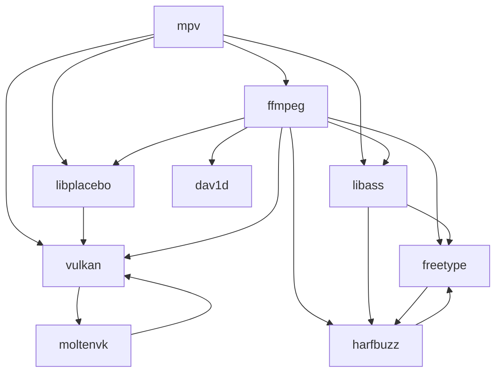

# mpv-build-macOS
A set of scripts and patches that help build [mpv](https://mpv.io) with [MoltenVK](https://github.com/KhronosGroup/MoltenVK) support.  

### Requirements
- [Xcode.app](https://developer.apple.com/xcode/)
- [Homebrew](https://brew.sh)

### Preparation
1. Make sure Xcode is ready by running:  

   ```sh
   xcodebuild -runFirstLaunch
   ```

2. Clone the repository:  

   ```sh
   git clone "https://github.com/m154k1/mpv-build-macOS.git"
   cd mpv-build-macOS
   ```

3. Install dependencies from Homebrew:  

   ```sh
   xargs brew install --formula < homebrew/build.txt
   xargs brew install --formula < homebrew/runtime.txt
   ```

4. Create an installation directory for local packages:  

   ```sh
   sudo mkdir /opt/local
   sudo chown $USER:admin /opt/local
   ```

### Build and install
1. [**Vulkan Loader**](https://github.com/KhronosGroup/Vulkan-Loader) & [**Vulkan Headers**](https://github.com/KhronosGroup/Vulkan-Headers)  

   ```sh
   git -C src clone "https://github.com/KhronosGroup/Vulkan-Loader.git"
   git -C src clone "https://github.com/KhronosGroup/Vulkan-Headers.git"
   ./build-vulkan
   ```

2. [**MoltenVK**](https://github.com/KhronosGroup/MoltenVK)  

   ```sh
   git -C src clone "https://github.com/KhronosGroup/MoltenVK.git"
   ./build-moltenvk
   ```

3. [**libplacebo**](https://code.videolan.org/videolan/libplacebo)  

   ```sh
   git -C src clone --recursive "https://code.videolan.org/videolan/libplacebo.git"
   ./build-libplacebo
   ```

4. [**dav1d**](https://code.videolan.org/videolan/dav1d)  

   ```sh
   git -C src clone "https://code.videolan.org/videolan/dav1d.git"
   ./build-dav1d
   ```

5. [**FreeType**](https://gitlab.freedesktop.org/freetype/freetype) & [**HarfBuzz**](https://github.com/harfbuzz/harfbuzz)  

   ```sh
   git -C src clone "https://gitlab.freedesktop.org/freetype/freetype.git"
   git -C src clone "https://github.com/harfbuzz/harfbuzz.git"
   ./build-freetype -Dharfbuzz=disabled
   ./build-harfbuzz
   ./build-freetype
   ```

6. [**libass**](https://github.com/libass/libass)  

   ```sh
   git -C src clone "https://github.com/libass/libass.git"
   ./build-libass
   ```

7. [**FFmpeg**](https://git.ffmpeg.org/ffmpeg.git)  

   ```sh
   git -C src clone "https://git.ffmpeg.org/ffmpeg.git"
   ./build-ffmpeg
   ```

8. [**mpv**](https://github.com/mpv-player/mpv)  

   ```sh
   git -C src clone "https://github.com/mpv-player/mpv.git"
   git -C src/mpv apply "$(realpath patches/mpv)"/*
   ./build-mpv
   ```

9. Add binaries to your `$PATH`:  

   ```sh
   cd ~/.local/bin
   ln -s /opt/local/mpv/bin/mpv
   ln -s /opt/local/ffmpeg/bin/ffmpeg
   ln -s /opt/local/ffmpeg/bin/ffprobe
   ```

### Configuration

```cfg
# ~/.config/mpv/mpv.conf

vo=gpu-next
gpu-context=macvk
```

### Environment variables

- `MTL_HUD_ENABLED=1`  
  Enables the [Metal Performance HUD](https://developer.apple.com/documentation/xcode/monitoring-your-metal-apps-graphics-performance).  

- `MVK_CONFIG_LOG_LEVEL=3`  
  Enables verbose MoltenVK logging.  

---

### Dependency graph



---

### Patches

- [`mpv/0001-vo-gpu-next-videotoolbox.patch`](/patches/mpv/0001-vo-gpu-next-videotoolbox.patch)  
  source: mpv-player/mpv#12776  

- [`mpv/0002-ao-coreaudio-fix-idle.patch`](/patches/mpv/0002-ao-coreaudio-fix-idle.patch)  
  source: mpv-player/mpv#11667  
